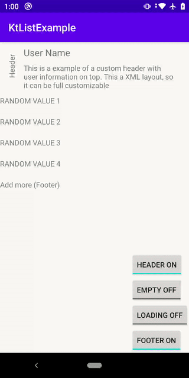

# Kist
**RecycleView without boilerplates**


[](https://circleci.com/gh/AraujoJordan/Kist)
[](https://github.com/AraujoJordan/Kist/LICENSE)
[](https://jitpack.io/AraujoJordan/Kist/)


Kist is a android library that provides a RecyclerView.Adapter implementation that make easier to implement things like Headers, Footers, Empty Fallbacks, Infinite Scrolling and so on. It will also make it easy to implement the adapter itself as you don't need to implement ViewHolders and others boilerplate methods.

## 🚀 Why use Kist?

If you ever had to implement a list in your apps you know the amount of boilerplate that you have to add some elements to show. But that just the begin, if you want to add click actions, Headers, Footers, Infinite Scrolling, Empty screens fallback (when the list is empty) you know you have to make a lot of modifications in bindings, create ViewHolders, put the LayoutManager that you forgot or handle some async problems when updating list while scrolling. it's a lot of work for a simple list right?
Kist is a small solution for that. You will use it as an Adapter or as a view itself and it will work magically.



## 📖 Usage

### 🌟 Simple list implementation

```xml
    <com.araujojordan.kist.Kist
        android:id="@+id/kistView"
        android:layout_width="match_parent"
        android:layout_height="wrap_content"
        app:itemLayout="@layout/item" />
```
```kotlin
    override fun onCreate(savedInstanceState: Bundle?) {
        super.onCreate(savedInstanceState)
        setContentView(R.layout.activity_main)                    

        kistView.bindLayout = { item, view -> view.item_text.text = (item as String) }
        kistView.add("One", "Two", "Three", "Four", "Five")
    }
```

And that's it. No more Adapter implementations, ViewHolders and others boilerplate to maintain in your code.
The list of the example is a String, but you can use ANY type of objects instead.

### 🌟 Infinite Scrolling implementation
```xml
    <com.araujojordan.kist.Kist
        android:id="@+id/kistView"
        android:layout_width="match_parent"
        android:layout_height="wrap_content"
        app:itemLayout="@layout/item" />
```
```kotlin
    override fun onCreate(savedInstanceState: Bundle?) {
        super.onCreate(savedInstanceState)
        setContentView(R.layout.activity_main)                    

        kistView.bindLayout = { item, view -> view.item_element.text = item as String }
        kistView.onEndOfScroll = { kistView.add("more") } //just this
    }
```
### 🌟 Header, Footer or Empty
```xml
 <com.araujojordan.kist.Kist
        android:id="@+id/kistView"
        android:layout_width="match_parent"
        android:layout_height="wrap_content"
        app:emptyLayout="@layout/header"
        app:footerLayout="@layout/header"
        app:headerLayout="@layout/header"
        app:itemLayout="@layout/item" />
```
### 🌟 Click and LongClick events
```kotlin
override fun onCreate(savedInstanceState: Bundle?) {
    super.onCreate(savedInstanceState)
    setContentView(R.layout.activity_main)                    
    
    kistView.bindLayout = { item, view -> view.item_element.text = item as String }
    kistView.onClickListener = { item, position, view ->  kistView.remove(position) }
}
```

## 📦 Installation

#### Step 1. Add the JitPack repository to your project build file

+ build.gradle (Project: YourProjectName)
```gradle
allprojects {
	repositories {
		maven { url 'https://jitpack.io' }
	}
}
```

#### Step 2. Add the dependency to your app build file 

+ build.gradle (Module: app) [](https://jitpack.io/AraujoJordan/Kist/)
```gradle
dependencies {
	implementation 'com.github.AraujoJordan:Kist:X.X.X'
}
```


## 📄 License
```
MIT License

Copyright (c) 2020 Jordan L. A. Junior

Permission is hereby granted, free of charge, to any person obtaining a copy
of this software and associated documentation files (the "Software"), to deal
in the Software without restriction, including without limitation the rights
to use, copy, modify, merge, publish, distribute, sublicense, and/or sell
copies of the Software, and to permit persons to whom the Software is
furnished to do so, subject to the following conditions:

The above copyright notice and this permission notice shall be included in all
copies or substantial portions of the Software.

THE SOFTWARE IS PROVIDED "AS IS", WITHOUT WARRANTY OF ANY KIND, EXPRESS OR
IMPLIED, INCLUDING BUT NOT LIMITED TO THE WARRANTIES OF MERCHANTABILITY,
FITNESS FOR A PARTICULAR PURPOSE AND NONINFRINGEMENT. IN NO EVENT SHALL THE
AUTHORS OR COPYRIGHT HOLDERS BE LIABLE FOR ANY CLAIM, DAMAGES OR OTHER
LIABILITY, WHETHER IN AN ACTION OF CONTRACT, TORT OR OTHERWISE, ARISING FROM,
OUT OF OR IN CONNECTION WITH THE SOFTWARE OR THE USE OR OTHER DEALINGS IN THE
SOFTWARE.
```
